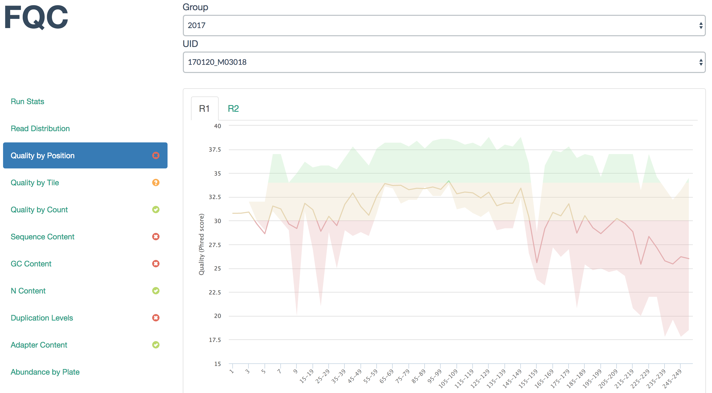
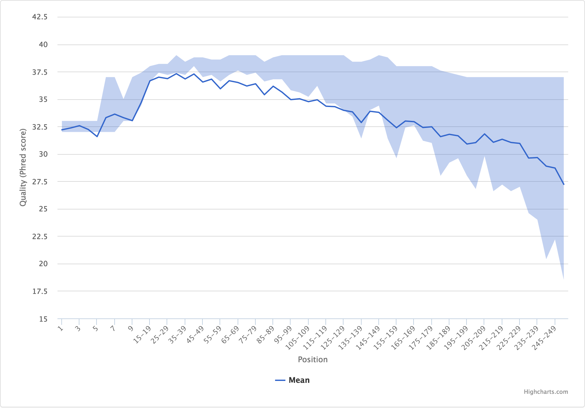
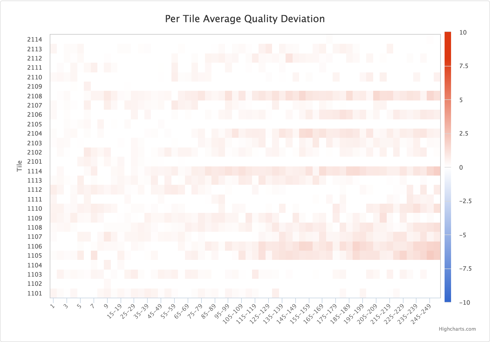
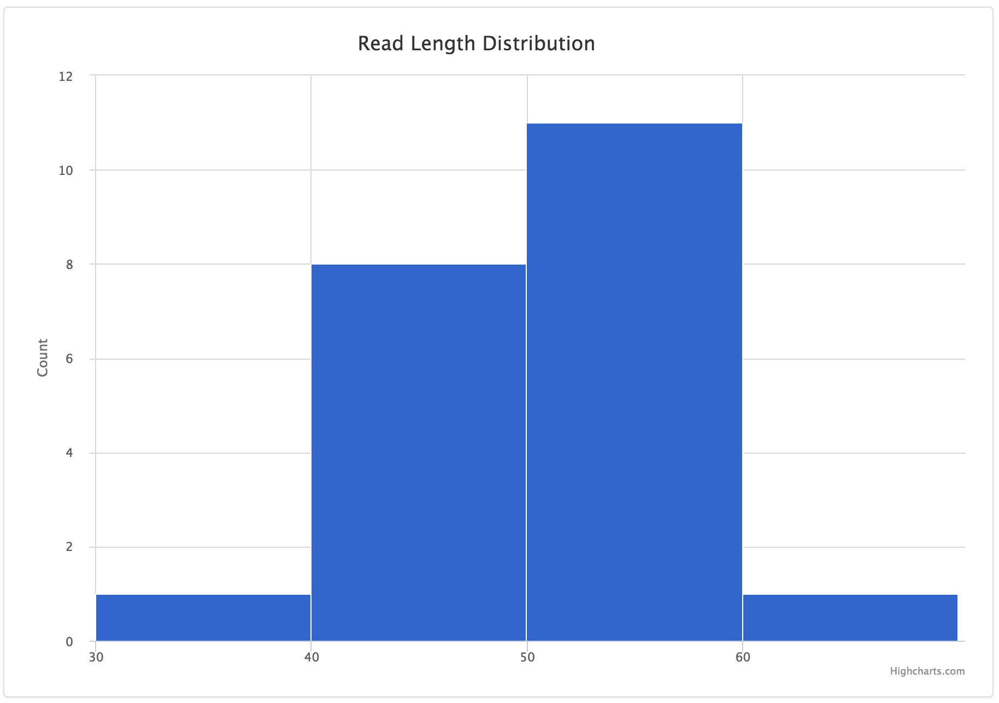
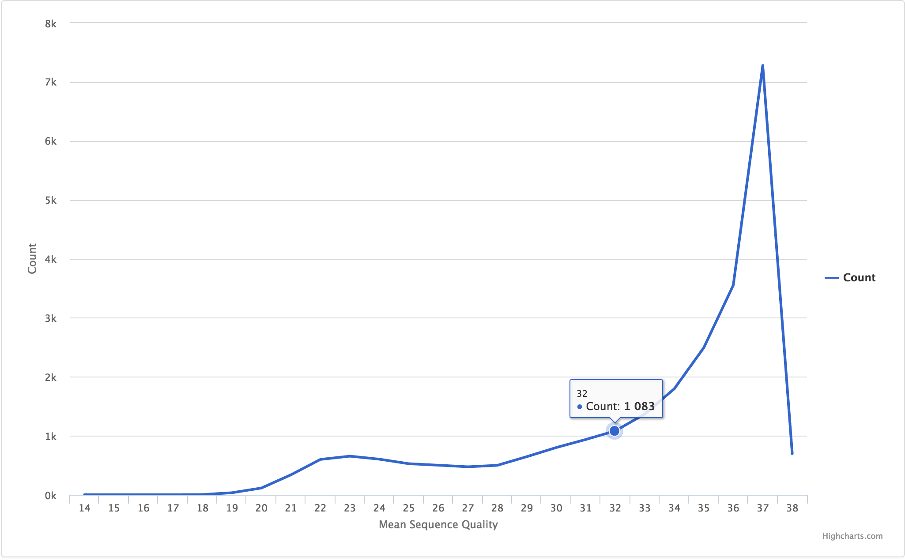
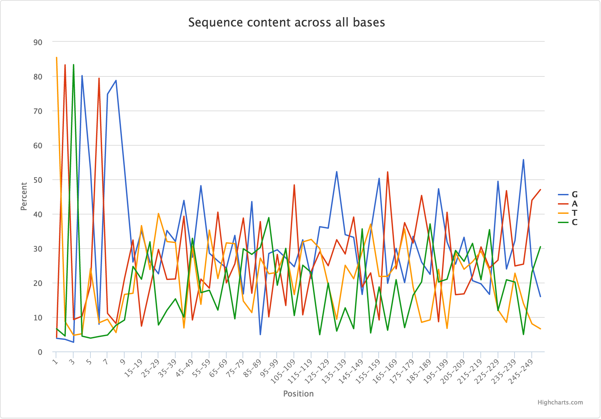
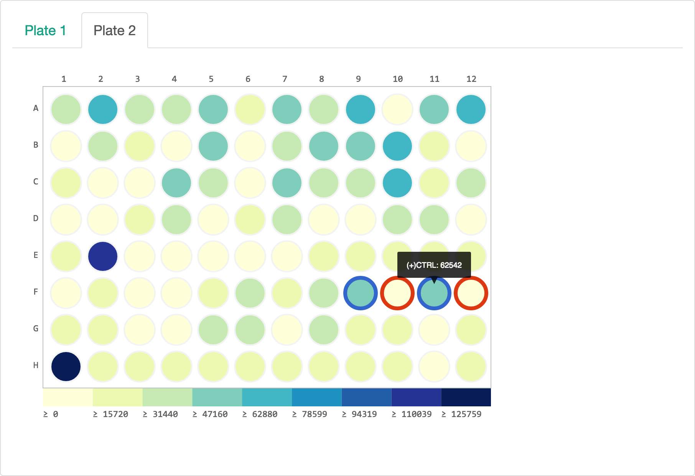
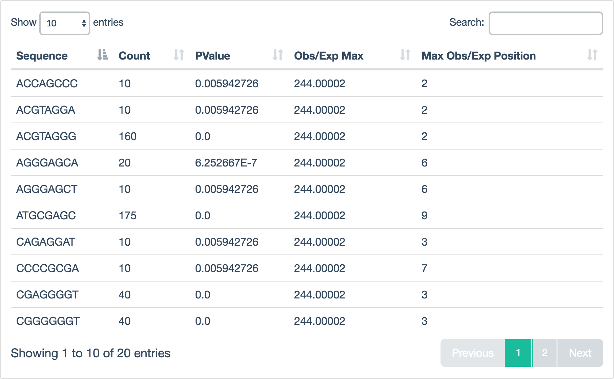

# Contents:

<!-- TOC depthFrom:1 depthTo:1 withLinks:1 updateOnSave:1 orderedList:0 -->

- [FASTQ QA/QC Dashboard](#fastq-qaqc-dashboard)
- [Requires](#requires)
- [Install](#install)
- [Processing a FASTQ](#processing-a-fastq)
- [Support Files](#support-files)
- [Adding Plots](#adding-plots)

<!-- /TOC -->

# FASTQ QA/QC Dashboard



We built this to better group FastQC result data across groups where each group is comprised of FASTQs related to an experiment or sequencing batch. Individual samples are grouped into paired-end sets when available and the dashboard's extensibility allows a user to add plots or tables as desired.

# Requires

Parsing the table and running `FastQC` is performed with code written for
Python 3. We recommend using [Anaconda](https://www.continuum.io/downloads) to
install the FastQC dependency:

```
conda install -c bioconda fastqc
```

And if you don't have Python yet:

```
conda install python
```

# Install

The dashboard reads local files, so install where you will eventually be
serving the site.

```
git clone https://github.com/brwnj/fqc.git
cd fqc
python setup.py install
```

This installs `fqc` command-line tool to process FASTQs and create the
dashboard.

Then to deploy a local copy from within the `fqc` directory, you can run:

```
python -m http.server
```

And navigate to `localhost:8000`.

By default, this will show the test data QC as determined by the data
directory in `js/fqc.js`:

```
var filePath = "/fqc/tests/data/qc/plot_data/"
```

Edit `fqc.js` to your local path **within** the `fqc` directory tree.

# Processing a FASTQ

The first time this is run, it will build the entire backend of the site.
Additional FASTQs being written to the same output directory are added to
the backend according to Group ID and UID.

## Single-end FASTQ

```
$ fqc qc group_2016 sample1 test_r1.fastq.gz
[2016-07-26 13:24 INFO] Writing data to: plot_data/group_2016/sample1
[2016-07-26 13:24 INFO] Running FastQC
[2016-07-26 13:27 INFO] Extracting data from FastQC archives
[2016-07-26 13:27 INFO] Processing of sample1 complete
```

## Paired-end FASTQs

```
fqc qc --r2 test_r2.fastq.gz group_2016 sample2 test_r1.fastq.gz
```

# Support Files

## groups.json

Located within the `plot_data` directory, this holds metadata for each group
and samples within the groups:

```
[
    {
        "group_id": "group_01",
        "uids": [
            "test_01"
        ]
    },
    {
        "group_id": "group_00",
        "uids": [
            "test_00"
        ]
    }
]
```

Renders as:


The sample ID and group ID must match the underlying directory tree that is
built by `fqc qc` and maintained when using `fqc batch` or `fqc add`.

And the directory tree of this simple example:

```
plot_data/
├── group_00
│   └── test_00
│       ├── R1
│       ├── R2
│       └── config.json
├── group_01
│   └── test_01
│       ├── R1
│       ├── R2
│       └── config.json
└── groups.json
```

## config.json

Holds metadata for each sample inside the group folder. Each entry must have a `tab_name`, `filename`, and `chart_properties`.

### Status

Possible (meaningful) values are `pass`, `fail`, and `warn`, which render respectively as:


### Area Range

Example data:

| Base | Mean   | Lower Quartile | Upper Quartile |
|------|--------|----------------|----------------|
| 1    | 32.193 | 32.0           | 33.0           |
| 2    | 32.365 | 32.0           | 33.0           |
| 3    | 32.570 | 32.0           | 33.0           |

JSON entry:

```
{
    "filename": "R1/Per_base_sequence_quality.csv",
    "tab_name": "Quality by Position",
    "status": "pass",
    "chart_properties": {
        "type": "arearange",
        "x_label": "Position",
        "x_value": "Base",
        "y_label": "Quality (Phred score)",
        "lower_quartile": "Lower Quartile",
        "upper_quartile": "Upper Quartile",
        "mean": "Mean"
    }
}
```



There is support for adding zones as well, if you're going for the classic FastQC look and feel:

```
{
    "filename": "R1/Per_base_sequence_quality.csv",
    "tab_name": "Quality by Position",
    "status": "pass",
    "chart_properties": {
        "type": "arearange",
        "x_label": "Position",
        "x_value": "Base",
        "y_label": "Quality (Phred score)",
        "lower_quartile": "Lower Quartile",
        "upper_quartile": "Upper Quartile",
        "mean": "Mean",
        "zones": [
            {"value": 30, "color": "#e5afb0"},
            {"value": 34, "color": "#e6d6b1"},
            {"color": "#b0e5b1"}
        ]
    }
}
```


### Bar

Example data:

| POSITION | READ_LENGTH |
|----------|-------------|
| 0        | 51          |
| 1        | 45          |
| 2        | 54          |
| 3        | 52          |

JSON entry:

```
    {
        "tab_name": "Read Length Bar Chart",
        "filename": "histogram.csv",
        "chart_properties": {
            "y_label": "Read Length",
            "x_value": "POSITION",
            "y_value": [
                "READ_LENGTH"
            ],
            "subtitle": "Read Length",
            "x_label": "Position",
            "type": "bar"
        }
    }
```


### Heatmap

Example data:

| Tile | Base | Mean               |
|------|------|--------------------|
| 1101 | 1    | 0.4305431013906045 |
| 1101 | 2    | 0.1525106635342368 |
| 1101 | 3    | 0.0202493599609709 |

JSON entry:

```
{
    "filename": "R1/Per_tile_sequence_quality.csv",
    "tab_name": "Quality by Tile",
    "status": "pass",
    "chart_properties": {
        "type": "heatmap",
        "subtitle": "Per Tile Average Quality Deviation",
        "x_label": "Position",
        "x_value": "Base",
        "y_label": "Tile",
        "y_value": "Tile",
        "shape": "square",
        "value": "Mean",
        "min": "-10",
        "max": "10",
        "min_color": "#36c",
        "mid_color": "#ffffff",
        "max_color": "#dc3912"
    }
}
```



### Histogram

Example data:

| POSITION | READ_LENGTH |
|----------|-------------|
| 0        | 51          |
| 1        | 45          |
| 2        | 54          |
| 3        | 52          |

JSON entry:

```
{
    "tab_name": "Read Length Histogram",
    "filename": "histogram.csv",
    "chart_properties": {
        "y_label": "Count",
        "x_value": "POSITION",
        "y_value": [
            "READ_LENGTH"
        ],
        "step": 10,
        "subtitle": "Read Length Distribution",
        "x_label": "Read Lengths",
        "type": "histogram"
    }
}
```



### Line

Example data:

| Quality | Count |
|---------|-------|
| 14      | 1.0   |
| 15      | 0.0   |
| 16      | 0.0   |

JSON entry:

```
{
    "filename": "R1/Per_sequence_quality_scores.csv",
    "tab_name": "Quality by Count",
    "status": "pass",
    "chart_properties": {
        "type": "line",
        "x_label": "Mean Sequence Quality",
        "x_value": "Quality",
        "y_label": "Count"
    }
}
```



When multiple y-values are being plotted:

| Base | G     | A      | T      | C      |
|------|-------|--------|--------|--------|
| 1    | 3.832 | 4.148  | 85.424 | 6.596  |
| 2    | 3.531 | 83.268 | 8.704  | 4.496  |
| 3    | 2.692 | 9.264  | 4.712  | 83.332 |
| 4    | 80.14 | 10.252 | 5.152  | 4.456  |

JSON entry:

```
{
    "filename": "R1/Per_base_sequence_content.csv",
    "tab_name": "Sequence Content",
    "status": "fail",
    "chart_properties": {
        "type": "line",
        "subtitle": "Sequence content across all bases",
        "x_label": "Position",
        "x_value": "Base",
        "y_label": "Percent",
        "y_value": [
            "G",
            "A",
            "T",
            "C"
        ]
    }
}
```



### Plate Heatmap

A nicely spaced heatmap specifically for showing trends over sample plates. Definitions for colors are optional.

Example data:

| WELL_COL | WELL_ROW | TOTAL_CONTAMINATION | TOTAL_PAIRED_READS | LABEL   |
|----------|----------|---------------------|--------------------|---------|
| 1        | A        | 6                   | 205                |         |
| 2        | A        | 14                  | 103                | (+)CTRL |
| 3        | A        | 0                   | 125                | (-)CTRL |

JSON entry:

```
{
    "filename": [
        [
            "Plate 1",
            "plt1_counts.csv"
        ],
        [
            "Plate 2",
            "plt2_counts.csv"
        ]
    ],
    "tab_name": "Plate With Color Defs",
    "status": "fail",
    "chart_properties": {
        "type": "plateheatmap",
        "x_value": "WELL_COL",
        "y_value": [
            "WELL_ROW"
        ],
        "shape": "circle",
        "value": "TOTAL_PAIRED_READS",
        "label": "LABEL",
        "colors": {
            "(-)CTRL": "#1f77b4",
            "(+)CTRL": "#d62728"
        }
    }
}
```



### Table

Example data:

| Sequence | Count | PValue      | Obs/Exp Max | Max Obs/Exp Position |
|----------|-------|-------------|-------------|----------------------|
| ACCAGCCC | 10    | 0.005942726 | 244.00002   | 2                    |
| GGGGTTAG | 20    | 6.252667E-7 | 244.00002   | 8                    |
| GATGCGAG | 175   | 0.0         | 244.00002   | 8                    |

JSON entry:

```
{
    "filename": "R1/Kmer_Content.csv",
    "tab_name": "Kmer Content",
    "status": "warn",
    "chart_properties": {
        "type": "table"
    }
}
```



### Plot Tabs

Tabs can be added to the plot area using a list of lists for the `filename` attribute. The first position is the name of the tab while the second is the file path.

```
"filename": [
        [
            "Plate 1",
            "plt1_counts.csv"
        ],
        [
            "Plate 2",
            "plt2_counts.csv"
        ]
]
```

Which will render as:


# Adding Plots

```
fqc add --x-value WELL_COL \
    --y-value WELL_ROW  \
    --shape circle \
    --value TOTAL_PAIRED_READS \
    --label "LABEL" \
    plot_data/group_00/test_00/config.json \
    "Reads by Plate" \
    plateheatmap \
    "Plate 1",plt1_counts.csv "Plate 2",plt2_counts.csv
```

This copies data into the necessary local folders and appends the following JSON entry onto `plot_data/group_00/test_00/config.json`:

```
{
    "filename": [
        [
            "Plate 1",
            "plt1_counts.csv"
        ],
        [
            "Plate 2",
            "plt2_counts.csv"
        ]
    ],
    "tab_name": "Reads by Plate",
    "chart_properties": {
        "type": "plateheatmap",
        "x_value": "WELL_COL",
        "y_value": [
            "WELL_ROW"
        ],
        "shape": "circle",
        "value": "TOTAL_PAIRED_READS",
        "label": "LABEL"
    }
}
```

## Manual Editting

Plot data can be added manually to the UID directory by adding the data into a given directory and editting the `config.json` for that UID. If you're adding a new run, you will have to add it to `groups.json`.
